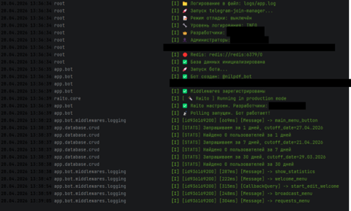
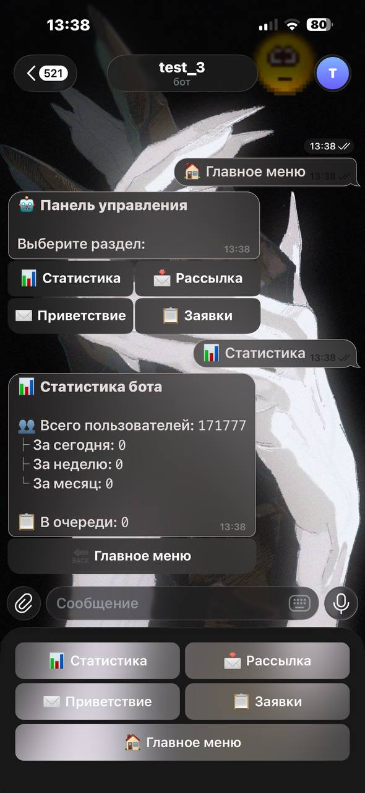
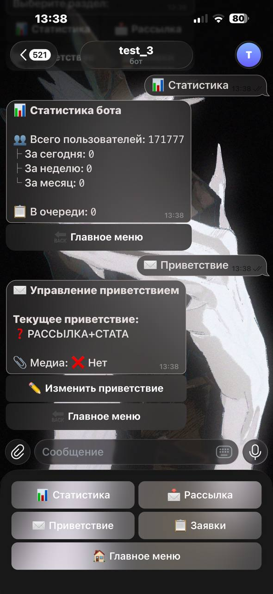
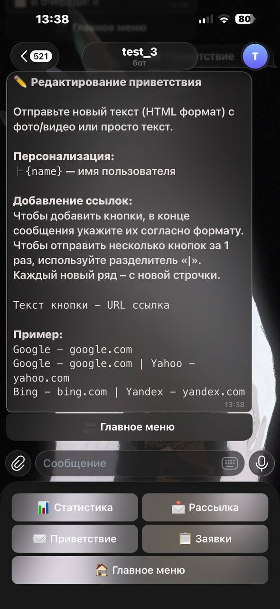
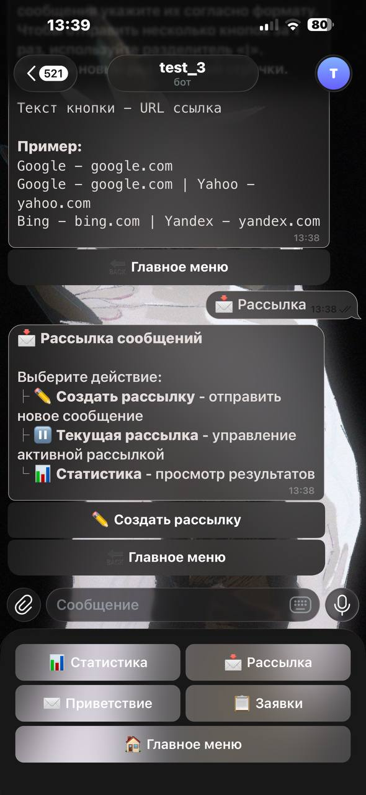
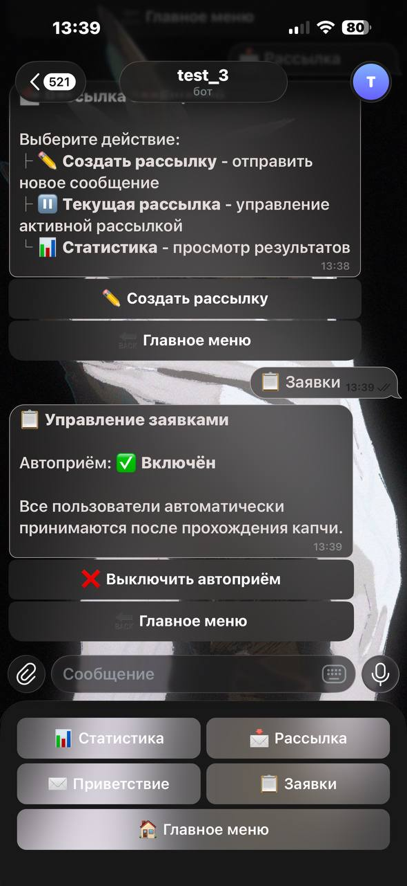

# 🤖 Telegram Join Manager

Современный бот для управления заявками в Telegram-группы с капчей, рассылкой и статистикой.

## ✨ Основные возможности

### 🔐 Управление заявками
- **Автоматический приём** с toggle в админ-панели
- **Ручное управление** с полной информацией о заявке
- **Очередь** с отображением времени ожидания и позиции
- **Массовые действия** (принять/отклонить несколько заявок)
- **Фильтры** (новые/старые/за период)

### 🧩 Капча
- Динамическая генерация вариантов
- Несколько типов: смайлики, картинки, математика
- Настраиваемый таймаут
- Повторные попытки с блокировкой после превышения

### 💬 Приветственные сообщения
- Персонализация с `{name}`
- Фото/видео вложения
- До 20 inline-кнопок
- A/B тестирование вариантов
- Inline-кнопка согласия с правилами

### 📢 Рассылка
- Предпросмотр перед отправкой
- Тестовая отправка себе
- Персонализация `{name}` и `{username}`
- Статистика в реальном времени
- Возможность остановить рассылку
- Сохранение черновиков

### 📊 Статистика
- Общее количество пользователей
- Новые за день/неделю/месяц
- Размер очереди на вступление
- Статистика по капче
- Забаненные пользователи
- История рассылок

### 🛡️ Безопасность
- Многоуровневая система ролей (raito)
- Логирование всех действий
- Rate limiting
- Валидация всех данных

## 🏗️ Технологический стек

- **Framework**: aiogram 3.13+
- **Database**: SQLAlchemy 2.0 (async) + aiosqlite
- **Migrations**: Alembic
- **Cache/FSM**: Redis
- **DI**: dishka
- **Config**: pydantic-settings
- **Roles**: raito
- **Logging**: structlog + colorama
- **Testing**: pytest + pytest-asyncio

## 🚀 Быстрый старт

### Docker (рекомендуется)

```bash
# 1. Клонировать репозиторий
git clone https://github.com/yourusername/telegram-join-manager.git
cd telegram-join-manager

# 2. Настроить .env
cp .env.example .env
# Отредактируй .env и добавь BOT_TOKEN и DEVELOPERS

# 3. Запустить
docker-compose up -d

# 4. Применить миграции (если нужно)
docker-compose exec bot alembic upgrade head
```

### Локально

```bash
# 1. Python 3.12+
python -m venv venv
source venv/bin/activate  # Linux/Mac
# venv\Scripts\activate  # Windows

# 2. Установить зависимости
pip install -e .

# 3. Настроить .env
cp .env.example .env

# 4. Применить миграции
alembic upgrade head

# 5. Запустить бота
python main.py
```

## 📁 Структура проекта

```
telegram-join-manager/
├── alembic/                  # Миграции базы данных
├── app/
│   ├── core/                 # Конфигурация и логирование
│   ├── database/             # Модели и CRUD
│   ├── services/             # Бизнес-логика
│   ├── bot/                  # Handlers, keyboards, states
│   └── utils/                # Вспомогательные функции
├── data/                     # SQLite база (gitignored)
├── logs/                     # Логи (gitignored)
├── tests/                    # Тесты
├── docker-compose.yml
├── Dockerfile
├── main.py                   # Точка входа
└── pyproject.toml
```

## ⚙️ Конфигурация

Основные параметры в `.env`:

```bash
BOT_TOKEN=              # Токен бота от @BotFather
DEVELOPERS=             # ID разработчиков (через запятую)
DATABASE_URL=           # Путь к БД
REDIS_URL=              # URL Redis
CAPTCHA_ENABLED=        # Включить капчу
AUTO_ACCEPT_DEFAULT=    # Автоприём по умолчанию
```

Полный список параметров см. в `.env.example`

## 🔧 Команды бота

### Для пользователей
- Автоматическая обработка заявок + капча

### Для админов
- `/start` — Админ-панель
- `/ban <user_id>` — Забанить пользователя
- `/unban <user_id>` — Разбанить
- `/banlist` — Список забаненных

### Админ-меню (кнопки)
- 📊 Статистика
- 📩 Рассылка
- ✉️ Приветствие
- 📋 Заявки
- ⚙️ Настройки

## 🧪 Тестирование

```bash
# Запустить все тесты
pytest

# С покрытием
pytest --cov=app --cov-report=html

# Конкретный модуль
pytest tests/test_handlers.py
```

## 📝 Миграции

```bash
# Создать новую миграцию
alembic revision --autogenerate -m "description"

# Применить миграции
alembic upgrade head

# Откатить миграцию
alembic downgrade -1
```

## 🤝 Разработка

```bash
# Установить dev-зависимости
pip install -e ".[dev]"

# Линтинг
ruff check .

# Форматирование
ruff format .

# Типы (опционально)
mypy app/
```

## 📄 Лицензия

MIT

## 👤 Автор

Made with 💜 by kihaas

## 🔗 Ссылки

- [Документация aiogram](https://docs.aiogram.dev/)
- [SQLAlchemy Docs](https://docs.sqlalchemy.org/)
- [Raito GitHub](https://github.com/Aidenable/Raito)

## Демонстрация






