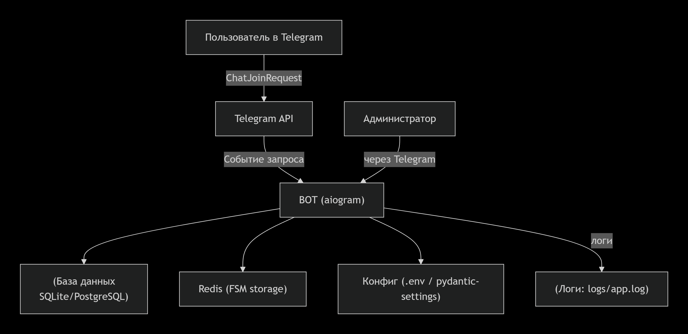

# Архитектура telegram-join-manager

telegram-join-manager — это Telegram‑бот на базе `aiogram`, предназначенный для автоматического управления входящими join‑запросами в приватные группы и каналы, с использованием капч‑проверок и капчи.

## Схема

## Компоненты схемы:

Пользователь в Telegram – источник join‑запросов.

Telegram API – принимает запросы и передаёт боту.

BOT (aiogram) – основной движок бота.

База данных – хранит заявки, статусы, историю.

Redis – хранилище FSM‑состояний (капча, ожидание ответа).

Конфиг – параметры из .env через pydantic-settings.

Администратор – управляет ботом через Telegram.

Логи – файл logs/app.log.

## Основные компоненты

- **Бот (aiogram):**  
  Обрабатывает входящие `ChatJoinRequest`‑события, высылает капчу, проверяет ответы пользователей и принимает/отклоняет запросы.

- **База данных (SQLAlchemy + aiosqlite / PostgreSQL):**  
  Хранит:
  - заявки пользователей (telegram‑id, никнейм, дата запроса, статус);
  - время последнего взаимодействия;
  - историю входов/отклонений.

- **Redis:**  
  Используется как backend для FSM (aiogram FSM storage) для хранения состояний пользователя во время прохождения капчи и ожидания ответа.

- **Конфигурация (.env / pydantic-settings):**  
  Загрузка `BOT_TOKEN`, `API_ID`, `API_HASH`, `developers`, `admin_ids`, `database_url`, `redis_url` и настроек логирования.

## Поток обработки запроса

1. Пользователь переходил по инвайт‑ссылке приватного чата/канала.
2. Telegram генерирует `ChatJoinRequest` и отправляет его боту.
3. Бот:
   - создаёт запись в БД;
   - отправляет пользователю сообщение‑капчу;
   - переводит пользователя в состояние `waiting_captcha`;
4. Пользователь присылает ответ:
   - если верно — бот подтверждает `ChatJoinRequest` и меняет статус в БД;
   - если неверно — бот отклоняет запрос и фиксирует попытку.

## Безопасность и ограничения

- Бот не хранит привычные пароли, а только hash‑капчи / краткосрочное состояние.
- Вся бизнес‑логика и настройки отделены от GitHub‑кода.