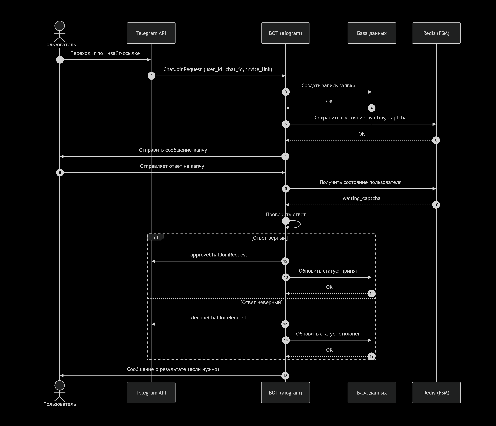

## Схема

## Ключевые шаги:

Пользователь переходит по инвайт‑ссылке.

Telegram отправляет ChatJoinRequest боту.

Бот создаёт запись в БД, сохраняет состояние в Redis.

Отправляется капча, пользователь отвечает.

Проверка ответа: при успехе – подтверждение входа, при ошибке – отклонение.

Статус обновляется в БД, пользователь получает уведомление.